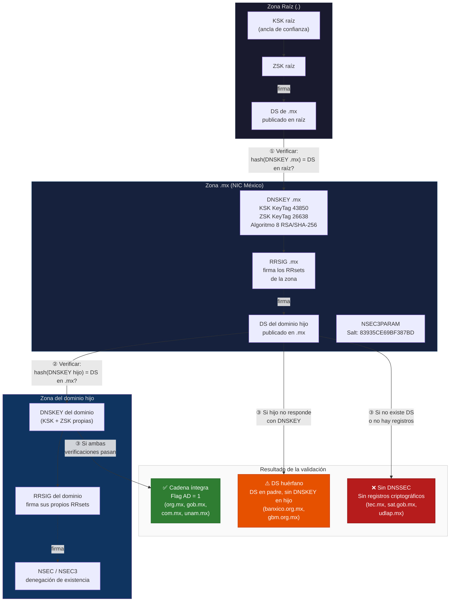

# Flujo de validación DNSSEC (raíz → TLD → dominio)

## Lectura del diagrama

La validación DNSSEC se realiza eslabón por eslabón, de arriba hacia abajo:

1. **Raíz → .mx:** El resolver toma el registro DS de `.mx` publicado en la zona raíz y verifica que su hash coincida con el DNSKEY de la zona `.mx`. Si coincide, el primer eslabón es válido.

2. **.mx → dominio hijo:** El resolver toma el DS del dominio hijo publicado en `.mx` y verifica que su hash coincida con el DNSKEY que el dominio hijo publica en su propia zona. Si coincide, el segundo eslabón es válido.

3. **Resultado:** Si ambas verificaciones pasan y las firmas RRSIG están vigentes, el resolver activa el flag AD (Authenticated Data) en la respuesta, confirmando la autenticidad del dominio. Si algún eslabón falla, la cadena se rompe.

### Patrones de fallo encontrados

| Patrón | Causa | Dominios afectados |
|--------|-------|--------------------|
| DS huérfano | DS existe en zona padre pero la zona hija no responde con DNSKEY ni RRSIG | banxico.org.mx, gbm.org.mx |
| Sin DNSSEC | No hay registros criptográficos en la zona propia | tec.mx, sat.gob.mx |
| DS desalineado | DS en padre no coincide con DNSKEY en zona hija | udlap.mx |
